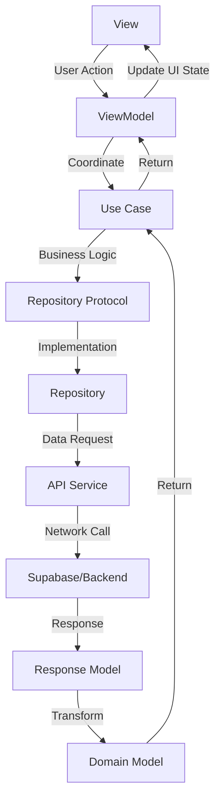

# CH-4 App Architecture Guide - Networking & Event Management 🎯

A comprehensive guide to understanding the **Modular Clean Architecture + MVVM** implementation in the CH-4 iOS networking and event management app, incorporating modern iOS development best practices.

## 📋 Table of Contents

1. [Overview](#overview)
2. [Modular Architecture Approach](#modular-architecture-approach)
3. [Feature-Based Structure](#feature-based-structure)
4. [Architecture Layers with Clear Boundaries](#architecture-layers-with-clear-boundaries)
5. [Data Flow](#data-flow)
6. [Code Examples](#code-examples)
7. [Design Patterns](#design-patterns)
8. [Dependency Management](#dependency-management)
9. [Testing Strategy](#testing-strategy)
10. [Project Decisions & Rationale](#project-decisions--rationale)

## Overview

CH-4 is a SwiftUI-based iOS networking and event management application that demonstrates **Modular Clean Architecture** principles combined with the **MVVM (Model-View-ViewModel)** pattern. This architecture enables scalable networking event management with clear separation of concerns through feature-based modularization.

### Key Benefits
- ✅ **Modular**: Feature-based modules for better scalability
- ✅ **Testable**: Each layer and module can be tested independently
- ✅ **Maintainable**: Clear boundaries and responsibilities
- ✅ **Scalable**: Easy to add new features without affecting existing ones
- ✅ **Flexible**: Easy to change implementations within modules
- ✅ **Memory Efficient**: Proper object lifecycle management
- ✅ **Real-time**: Supabase integration for live updates
- ✅ **Secure**: Keychain-based authentication and data protection

## Modular Architecture Approach

### Why Modular Architecture?

As networking applications grow, a flat architecture becomes difficult to maintain. Modular architecture provides:

- **Feature Isolation**: Each feature (Auth, Event, Profile, etc.) is self-contained
- **Reduced Build Times**: Only affected modules need rebuilding
- **Team Scalability**: Different teams can work on different modules
- **Cleaner Dependencies**: Explicit module boundaries
- **Easier Testing**: Module-specific test suites

### Module Types

1. **Feature Modules**: Self-contained features (Auth, Event, Profile, Onboarding, etc.)
2. **Infrastructure Modules**: Shared utilities and services (NetworkingKit, UIComponentsKit, FoundationExtras)
3. **Core Module**: Fundamental app components (AppStateManager, APIClient, etc.)

## Feature-Based Structure

### Vertical Feature Organization

Each feature is organized vertically with all its layers:

```
CH-4/
├── Sources/
│   ├── Features/
│   │   ├── Auth/
│   │   │   ├── Presentation/
│   │   │   │   ├── AuthViewContainer.swift
│   │   │   │   ├── AuthViewModel.swift
│   │   │   │   ├── SignInView.swift
│   │   │   │   └── Components/
│   │   │   │       ├── CustomTextField.swift
│   │   │   │       ├── FloatingCardView.swift
│   │   │   │       └── ScrollingCarouselImage.swift
│   │   │   ├── Domain/
│   │   │   │   ├── Models/
│   │   │   │   │   └── User.swift
│   │   │   │   ├── UseCases/
│   │   │   │   │   ├── SignInWithAppleUseCase.swift
│   │   │   │   │   ├── SignOutUseCase.swift
│   │   │   │   │   └── VerifyAndGenerateTokenUseCase.swift
│   │   │   │   └── Protocols/
│   │   │   │       └── AuthRepositoryProtocol.swift
│   │   │   ├── Data/
│   │   │   │   ├── Network/
│   │   │   │   │   ├── AuthAPIService.swift
│   │   │   │   │   └── SupabaseAuthService.swift
│   │   │   │   ├── Repositories/
│   │   │   │   │   └── AuthRepository.swift
│   │   │   │   └── Response/
│   │   │   │       └── LoginResponse.swift
│   │   │   └── DI/
│   │   │       └── AuthDIContainer.swift
│   │   │
│   │   ├── Event/
│   │   │   ├── Presentation/
│   │   │   │   ├── CreateEventView.swift
│   │   │   │   ├── CreateEventViewModel.swift
│   │   │   │   ├── EventDateStepView.swift
│   │   │   │   ├── EventDescriptionView.swift
│   │   │   │   ├── EventDetailsStepView.swift
│   │   │   │   └── InteractiveMapLocationPicker.swift
│   │   │   ├── Domain/
│   │   │   │   ├── Models/
│   │   │   │   │   ├── Event.swift
│   │   │   │   │   └── EventValidateModel.swift
│   │   │   │   └── UseCases/
│   │   │   │       ├── CreateEventUseCase.swift
│   │   │   │       └── ValidateEventUseCase.swift
│   │   │   ├── Data/
│   │   │   │   ├── Network/
│   │   │   │   │   ├── EventAPIService.swift
│   │   │   │   │   └── PayloadDTO.swift
│   │   │   │   ├── Repositories/
│   │   │   │   │   └── EventRepository.swift
│   │   │   │   └── Response/
│   │   │   │       ├── CreateEventResponse.swift
│   │   │   │       └── ValidateEventResponse.swift
│   │   │   └── DI/
│   │   │       └── EventDIContainer.swift
│   │   │
│   │   ├── HomeAttendee/
│   │   │   ├── Presentation/
│   │   │   │   ├── HomeAttendee.swift
│   │   │   │   ├── HomeAttendeeViewModel.swift
│   │   │   │   ├── AttendeeRecommendation.swift
│   │   │   │   ├── EventDetailCard.swift
│   │   │   │   ├── EventJoinSheet.swift
│   │   │   │   ├── ManualEventCodeView.swift
│   │   │   │   └── ParticipantCardStack.swift
│   │   │   ├── Domain/
│   │   │   │   ├── Model/
│   │   │   │   │   ├── AttendeeRegisterModel.swift
│   │   │   │   │   └── RecommendationModel.swift
│   │   │   │   └── UseCases/
│   │   │   │       ├── FetchRecommendationUseCase.swift
│   │   │   │       └── RegisterAttendeeUseCase.swift
│   │   │   ├── Data/
│   │   │   │   ├── Network/
│   │   │   │   ├── Payload/
│   │   │   │   │   ├── RegisterAttendee.swift
│   │   │   │   │   └── SubmitGoalPayload.swift
│   │   │   │   └── Response/
│   │   │   │       ├── RecommendationResponse.swift
│   │   │   │       └── RegisterAttendeeResponse.swift
│   │   │   └── DI/
│   │   │       └── HomeAttendeeDIContainer.swift
│   │   │
│   │   ├── Onboarding/
│   │   │   ├── Presentation/
│   │   │   │   ├── DynamicQuestionView.swift
│   │   │   │   ├── GoalSelectionView.swift
│   │   │   │   ├── LoadingView.swift
│   │   │   │   └── Components/
│   │   │   │       ├── StyledMultiSelectView.swift
│   │   │   │       ├── StyledSingleSelectView.swift
│   │   │   │       └── StyledTextFieldView.swift
│   │   │   ├── Domain/
│   │   │   │   ├── Model/
│   │   │   │   │   ├── Model.swift
│   │   │   │   │   ├── QuestionAnswerModel.swift
│   │   │   │   │   └── MockQuestionProvider.swift
│   │   │   │   └── UseCases/
│   │   │   │       ├── FetchGoalsUseCase.swift
│   │   │   │       ├── SubmitAnswerUseCase.swift
│   │   │   │       └── SubmitGoalUseCase.swift
│   │   │   ├── Data/
│   │   │   │   ├── Network/
│   │   │   │   │   └── AttendeeAPIService.swift
│   │   │   │   ├── Repository/
│   │   │   │   │   └── AttendeeRepository.swift
│   │   │   │   └── Response/
│   │   │   │       └── SubmitGoalResponse.swift
│   │   │   └── DI/
│   │   │       └── OnBoardingDIContainer.swift
│   │   │
│   │   └── Profile/
│   │       ├── Presentation/
│   │       │   ├── UpdateProfileView.swift
│   │       │   ├── UpdateProfileViewModel.swift
│   │       │   └── Components/
│   │       │       └── HeaderSectionView.swift
│   │       ├── Domain/
│   │       │   ├── Models/
│   │       │   │   └── ProfessionListModel.swift
│   │       │   └── UseCases/
│   │       │       ├── FetchProfessionListUseCase.swift
│   │       │       └── UpdateProfileUseCase.swift
│   │       ├── Data/
│   │       │   ├── Network/
│   │       │   │   ├── ProfileAPIService.swift
│   │       │   │   └── ProfilePayloadDTO.swift
│   │       │   ├── Repositories/
│   │       │   │   ├── SupabaseRepository.swift
│   │       │   │   └── UserRepository.swift
│   │       │   └── Response/
│   │       │       ├── FetchProfessionsResponse.swift
│   │       │       └── UpdateProfileResponse.swift
│   │       └── DI/
│   │           └── ProfileDIContainer.swift
│   │
│   ├── Core/
│   │   ├── AppStateManager.swift
│   │   ├── APIClient.swift
│   │   ├── SupabaseClient.swift
│   │   ├── Endpoint.swift
│   │   ├── Keychain.swift
│   │   ├── LocationManager.swift
│   │   ├── ImageCacheManager.swift
│   │   ├── HapticManager.swift
│   │   └── RecommendationCacheManager.swift
│   │
│   ├── Components/
│   │   ├── CustomButton.swift
│   │   ├── AppTextField.swift
│   │   ├── CircularImagePicker.swift
│   │   ├── ParticipantCard.swift
│   │   ├── ParticipantCardNew.swift
│   │   ├── ProfileImageView.swift
│   │   ├── RefreshButton.swift
│   │   ├── SearchDropdown.swift
│   │   └── SelectableRectangleview.swift
│   │
│   └── Config/
│       └── AppConfig.template.swift
│
├── Modules/
│   ├── FoundationExtras/
│   │   └── Sources/
│   │       ├── Constants.swift
│   │       └── Logger.swift
│   │
│   ├── NetworkingKit/
│   │   └── Sources/
│   │       ├── Endpoint.swift
│   │       └── Supabase/
│   │           └── SupabaseClientProvider.swift
│   │
│   └── UIComponentsKit/
│       ├── Sources/
│       │   ├── Components/
│       │   │   └── PrimaryButton.swift
│       │   └── DesignSystem/
│       │       ├── AppColor.swift
│       │       ├── ColorHex.swift
│       │       └── Typography.swift
│       └── Resources/
│           ├── Fonts/
│           └── Media.xcassets/
│
└── CH4-AppClip/
    ├── Sources/
    │   ├── AppClipApp.swift
    │   ├── AppClipView.swift
    │   └── Core/
    │       └── AppStateManager.swift
    └── Resources/
        └── Assets.xcassets/
```

### Import Strategy

With modular architecture, imports become more explicit and manageable:

```swift
// Feature-specific imports
import FoundationExtras
import NetworkingKit
import UIComponentsKit

// Core infrastructure
import Supabase
import CodeScanner
```

## Architecture Layers with Clear Boundaries

### 🎨 1. Presentation Layer

**Purpose**: Handles UI and user interactions

**Components**:
- **Views**: SwiftUI views that display data
- **ViewModels**: Observable objects that manage UI state and coordinate with business logic
- **Components**: Reusable UI components

**Clear Boundary**: ViewModels should NOT contain business logic, only UI state management and coordination.

### 🏢 2. Domain Layer (Business Logic)

**Purpose**: Contains pure business logic and rules (framework-independent)

**Components**:
- **Models**: Business entities (User, Event, etc.)
- **Use Cases**: Specific business operations
- **Protocols**: Abstractions for external dependencies

**Clear Boundary**: This layer should be completely independent of frameworks and external concerns.

### 💾 3. Data Layer

**Purpose**: Manages data sources and implements domain interfaces

**Components**:
- **Responses**: API response models
- **Repositories**: Implementation of domain repository protocols
- **Network**: API service implementations
- **Payload**: Request payload models

**Clear Boundary**: Repository should NOT access API services directly, but through proper abstractions.

### ⚙️ 4. Infrastructure Layer

**Purpose**: Provides shared utilities and cross-cutting concerns

**Components**:
- **NetworkingKit**: Base networking infrastructure
- **UIComponentsKit**: Reusable UI components and design system
- **FoundationExtras**: Core utilities and extensions
- **Core**: App-wide utilities (AppStateManager, APIClient, etc.)

## Data Flow



### Improved Data Flow Example:

1. **User creates an event** → `CreateEventView`
2. **View calls ViewModel** → `CreateEventViewModel.createEvent()`
3. **ViewModel coordinates with Use Case** → `CreateEventUseCase.execute()`
4. **Use Case implements business logic and calls Repository** → `EventRepository.createEvent()`
5. **Repository calls API Service** → `EventAPIService.createEvent()`
6. **API returns Response models** → `CreateEventResponse`
7. **Repository transforms to Domain Models** → `Event`
8. **Use Case applies business rules** → Validated `Event`
9. **ViewModel updates UI state** → `@Published var isEventCreated`
10. **View automatically updates** → SwiftUI reactive updates

## Code Examples

### 🎯 Domain Model Example

```swift
// Features/Event/Domain/Models/Event.swift
public struct Event {
    public let id: String
    public let name: String
    public let start: Date
    public let end: Date
    public let detail: String
    public let locationName: String
    public let latitude: Double
    public let longitude: Double
    public let status: EventStatus
    public let maxParticipants: Int
    public let currentParticipants: Int
    public let createdBy: String
    public let isActive: Bool
    public let createdAt: Date
    public let updatedAt: Date
}

public enum EventStatus: String {
    case upcoming = "UPCOMING"
    case ongoing  = "ONGOING"
    case past     = "PAST"
}
```

### 📡 Response Model Example

```swift
// Features/Event/Data/Response/CreateEventResponse.swift
struct CreateEventResponse: Codable {
    let success: Bool
    let message: String
    let data: EventData
    
    struct EventData: Codable {
        let id: String
        let name: String
        let startTime: String
        let endTime: String
        let description: String
        let locationName: String
        let latitude: Double
        let longitude: Double
        let maxParticipants: Int
        let createdBy: String
        let createdAt: String
        let updatedAt: String
    }
}
```

### 🔄 Use Case Example

```swift
// Features/Event/Domain/UseCases/CreateEventUseCase.swift
protocol CreateEventUseCaseProtocol {
    func execute(eventData: CreateEventRequest) async -> Result<Event, Error>
}

class CreateEventUseCase: CreateEventUseCaseProtocol {
    private let repository: EventRepositoryProtocol
    
    init(repository: EventRepositoryProtocol) {
        self.repository = repository
    }
    
    func execute(eventData: CreateEventRequest) async -> Result<Event, Error> {
        // Business logic: validate event data
        guard !eventData.name.trimmingCharacters(in: .whitespacesAndNewlines).isEmpty else {
            return .failure(EventError.emptyName)
        }
        
        // Business logic: validate date range
        guard eventData.startDate < eventData.endDate else {
            return .failure(EventError.invalidDateRange)
        }
        
        // Business logic: validate participant limit
        guard eventData.maxParticipants > 0 else {
            return .failure(EventError.invalidParticipantLimit)
        }
        
        do {
            let event = try await repository.createEvent(eventData: eventData)
            return .success(event)
        } catch {
            return .failure(error)
        }
    }
}

enum EventError: Error {
    case emptyName
    case invalidDateRange
    case invalidParticipantLimit
}
```

### 🗄️ Repository Example

```swift
// Features/Event/Data/Repositories/EventRepository.swift
protocol EventRepositoryProtocol {
    func createEvent(eventData: CreateEventRequest) async throws -> Event
    func validateEvent(eventId: String) async throws -> EventValidateModel
}

class EventRepository: EventRepositoryProtocol {
    private let apiService: EventAPIServiceProtocol
    
    init(apiService: EventAPIServiceProtocol) {
        self.apiService = apiService
    }
    
    func createEvent(eventData: CreateEventRequest) async throws -> Event {
        let response = try await apiService.createEvent(eventData: eventData)
        
        return Event(
            id: response.data.id,
            name: response.data.name,
            start: DateFormatter.iso8601.date(from: response.data.startTime) ?? Date(),
            end: DateFormatter.iso8601.date(from: response.data.endTime) ?? Date(),
            detail: response.data.description,
            locationName: response.data.locationName,
            latitude: response.data.latitude,
            longitude: response.data.longitude,
            status: .upcoming,
            maxParticipants: response.data.maxParticipants,
            currentParticipants: 0,
            createdBy: response.data.createdBy,
            isActive: true,
            createdAt: DateFormatter.iso8601.date(from: response.data.createdAt) ?? Date(),
            updatedAt: DateFormatter.iso8601.date(from: response.data.updatedAt) ?? Date()
        )
    }
}
```

### 🎭 ViewModel Example

```swift
// Features/Event/Presentation/CreateEventViewModel.swift
@MainActor
class CreateEventViewModel: ObservableObject {
    @Published var eventName = ""
    @Published var eventDescription = ""
    @Published var startDate = Date()
    @Published var endDate = Date()
    @Published var locationName = ""
    @Published var maxParticipants = 10
    @Published var isCreating = false
    @Published var error: Error?
    @Published var isEventCreated = false
    
    private let createEventUseCase: CreateEventUseCaseProtocol
    
    init(createEventUseCase: CreateEventUseCaseProtocol) {
        self.createEventUseCase = createEventUseCase
    }
    
    func createEvent() async {
        isCreating = true
        error = nil
        
        let eventData = CreateEventRequest(
            name: eventName,
            description: eventDescription,
            startDate: startDate,
            endDate: endDate,
            locationName: locationName,
            maxParticipants: maxParticipants
        )
        
        let result = await createEventUseCase.execute(eventData: eventData)
        
        switch result {
        case .success:
            isEventCreated = true
        case .failure(let eventError):
            error = eventError
        }
        
        isCreating = false
    }
}
```

## Design Patterns

### 🏗️ 1. MVVM with Clear Boundaries

- **Model**: Domain models and business entities
- **View**: SwiftUI views (UI only)
- **ViewModel**: UI state management and coordination (NO business logic)

### 🧱 2. Repository Pattern

```swift
// Repository abstracts data access
class EventRepository: EventRepositoryProtocol {
    private let apiService: EventAPIServiceProtocol
    
    // Repository orchestrates data sources
    func createEvent(eventData: CreateEventRequest) async throws -> Event {
        // Implementation using API service
    }
}
```

### 🎯 3. Use Case Pattern

Each use case represents a specific business operation:

```swift
// Single responsibility
class CreateEventUseCase: CreateEventUseCaseProtocol {
    func execute(eventData: CreateEventRequest) async -> Result<Event, Error> {
        // Business logic implementation
    }
}

class ValidateEventUseCase: ValidateEventUseCaseProtocol {
    func execute(eventId: String) async -> Result<EventValidateModel, Error> {
        // Different business logic
    }
}
```

### 💉 4. Protocol-Oriented Dependency Injection

```swift
// All dependencies are protocols for testability
class CreateEventViewModel: ObservableObject {
    private let createEventUseCase: CreateEventUseCaseProtocol
    
    init(createEventUseCase: CreateEventUseCaseProtocol) {
        self.createEventUseCase = createEventUseCase
    }
}
```

## Dependency Management

### Feature-Specific Dependency Containers

```swift
// Features/Event/DI/EventDIContainer.swift
public final class EventDIContainer {
    public static let shared = EventDIContainer()
    
    private init() {}
    
    // MARK: - API Services
    public lazy var eventAPIService: EventAPIServiceProtocol = {
        EventAPIService()
    }()
    
    // MARK: - Repositories
    public lazy var eventRepository: EventRepositoryProtocol = {
        EventRepository(apiService: eventAPIService)
    }()
    
    // MARK: - Use Cases
    public lazy var createEventUseCase: CreateEventUseCaseProtocol = {
        CreateEventUseCase(repository: eventRepository)
    }()
    
    public lazy var validateEventUseCase: ValidateEventUseCaseProtocol = {
        ValidateEventUseCase(repository: eventRepository)
    }()
    
    // MARK: - View Models
    @MainActor public func makeCreateEventViewModel() -> CreateEventViewModel {
        CreateEventViewModel(createEventUseCase: createEventUseCase)
    }
}
```

### App State Management

```swift
// Core/AppStateManager.swift
@MainActor
public class AppStateManager: ObservableObject {
    public static let shared = AppStateManager()
    
    @Published var isAuthenticated = false
    @Published var currentRole: UserRole = .attendee
    @Published var user: UserData?
    @Published var selectedEvent: EventValidateModel?
    @Published var isJoinedEvent: Bool = false
    @Published var screen: Screen = .auth
    
    enum UserRole: String, CaseIterable {
        case attendee = "attendee"
        case creator = "creator"
    }
    
    enum Screen {
        case auth
        case onboarding
        case updateProfile(onProfileUpdated: (() -> Void)? = nil)
        case homeAttendee
        case homeCreator
        case appValue
    }
}
```

## Testing Strategy

### Protocol-Based Testing

```swift
// Tests/EventTests/CreateEventViewModelTests.swift
class CreateEventViewModelTests: XCTestCase {
    private var viewModel: CreateEventViewModel!
    private var mockCreateEventUseCase: MockCreateEventUseCase!
    
    override func setUp() {
        super.setUp()
        mockCreateEventUseCase = MockCreateEventUseCase()
        viewModel = CreateEventViewModel(createEventUseCase: mockCreateEventUseCase)
    }
    
    func testCreateEventSuccess() async {
        // Given
        let expectedEvent = Event.mock()
        mockCreateEventUseCase.result = .success(expectedEvent)
        
        // When
        await viewModel.createEvent()
        
        // Then
        XCTAssertTrue(viewModel.isEventCreated)
        XCTAssertFalse(viewModel.isCreating)
        XCTAssertNil(viewModel.error)
    }
}

class MockCreateEventUseCase: CreateEventUseCaseProtocol {
    var result: Result<Event, Error> = .success(Event.mock())
    
    func execute(eventData: CreateEventRequest) async -> Result<Event, Error> {
        return result
    }
}
```

### Infrastructure Module Testing

```swift
// Tests/CoreTests/APIClientTests.swift
class APIClientTests: XCTestCase {
    private var apiClient: APIClient!
    private var mockURLSession: MockURLSession!
    
    override func setUp() {
        super.setUp()
        mockURLSession = MockURLSession()
        apiClient = APIClient(urlSession: mockURLSession)
    }
    
    func testRequestWithAPIResponseSuccess() async throws {
        // Given
        let mockResponse = CreateEventResponse.mock()
        mockURLSession.data = try JSONEncoder().encode(mockResponse)
        
        // When
        let result = try await apiClient.requestWithAPIResponse(
            endpoint: .createEvent,
            responseType: CreateEventResponse.self
        )
        
        // Then
        XCTAssertEqual(result.data.name, mockResponse.data.name)
    }
}
```

## Project Decisions & Rationale

### Why Tuist?

**Benefits**:
- **Project Generation**: Consistent project structure across team
- **Modularization**: Easy module creation and dependency management
- **Build Optimization**: Faster incremental builds with proper module boundaries
- **Team Scalability**: Standardized project configuration

**Costs**:
- **Learning Curve**: Team needs to understand Tuist concepts
- **Maintenance**: Additional tool to maintain and update
- **Complexity**: Extra abstraction layer over Xcode projects

**Decision**: Worth it for medium to large projects with multiple developers, as it enforces good architecture practices and improves build times.

### Why iOS 16+?

**Benefits**:
- **Modern SwiftUI Features**: Access to newest UI capabilities
- **Performance Improvements**: Better runtime performance
- **Modern Swift Features**: Latest language improvements
- **Reduced Legacy Code**: No need to support older iOS versions

**Costs**:
- **Limited Audience**: Excludes users on older iOS versions
- **Market Penetration**: Smaller potential user base initially

**Decision**: For a networking/event management app, using iOS 16+ showcases modern development skills and reduces complexity.

### Why Supabase?

**Benefits**:
- **Real-time Features**: Live updates for event management
- **Authentication**: Built-in auth with Apple Sign-In support
- **Database**: PostgreSQL with real-time subscriptions
- **Storage**: File storage for event images
- **Edge Functions**: Serverless functions for business logic

**Costs**:
- **Vendor Lock-in**: Dependency on Supabase platform
- **Learning Curve**: Team needs to understand Supabase concepts

**Decision**: Supabase provides excellent real-time capabilities essential for networking events and simplifies backend development.

### Memory Management Strategy

**Approach**:
- **Minimal Singletons**: Only for truly global services (AppStateManager, APIClient)
- **Factory Pattern**: Create objects when needed through DI containers
- **Weak References**: Prevent retain cycles in ViewModels
- **Lazy Loading**: Initialize expensive objects only when required

```swift
// Good: Factory-based creation
container.register(CreateEventViewModel.self) {
    CreateEventViewModel(createEventUseCase: container.resolve())
}

// Avoid: Singleton for feature-specific objects
// lazy var createEventViewModel: CreateEventViewModel = CreateEventViewModel() // ❌
```

### App Clip Integration

**Benefits**:
- **Quick Access**: Users can join events without downloading the full app
- **Event Discovery**: QR code scanning for instant event access
- **Reduced Friction**: Lower barrier to entry for event participation

**Implementation**:
- Shared modules (NetworkingKit, UIComponentsKit) between main app and App Clip
- Minimal App Clip functionality focused on event joining
- Seamless transition to full app when needed

---

**Happy Networking! 🎯✨**

This architecture provides a robust foundation for building scalable, maintainable networking and event management iOS applications with clear module boundaries, proper separation of concerns, efficient memory management, and real-time capabilities.
