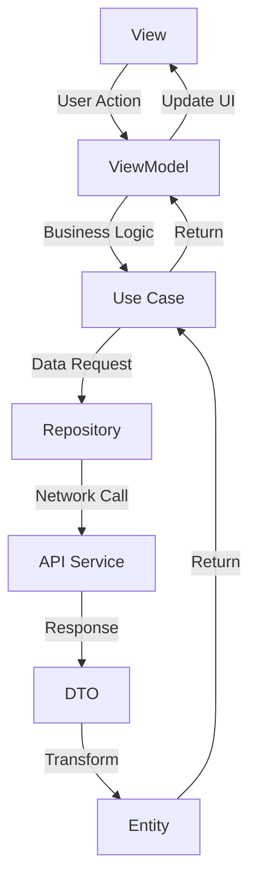

# Movy App Architecture Guide 🍿

A comprehensive guide to understanding the Clean Architecture + MVVM implementation in the Movy iOS app.

## 📋 Table of Contents

1. [Overview](#overview)
2. [Architecture Layers](#architecture-layers)
3. [Data Flow](#data-flow)
4. [Code Examples](#code-examples)
5. [Design Patterns](#design-patterns)
6. [Project Structure](#project-structure)

## Overview

Movy is a SwiftUI-based iOS movie search application that demonstrates **Clean Architecture** principles combined with the **MVVM (Model-View-ViewModel)** pattern. The architecture promotes separation of concerns, testability, and maintainability.

### Key Benefits
- ✅ **Testable**: Each layer can be tested independently
- ✅ **Maintainable**: Clear separation of responsibilities
- ✅ **Scalable**: Easy to add new features
- ✅ **Flexible**: Easy to change data sources or UI frameworks

## Architecture Layers

### 🎨 1. Presentation Layer (`/Presentation/`)

**Purpose**: Handles UI and user interactions

**Components**:
- **Views**: SwiftUI views that display data
- **ViewModels**: Observable objects that manage UI state
- **Common Components**: Reusable UI elements

**Example Structure**:
```
Presentation/
├── Common/
│   └── Components/
│       ├── ErrorView.swift
│       └── MyButton.swift
└── Scenes/
    ├── HomeView/
    │   ├── HomeView.swift
    │   └── HomeViewModel.swift
    └── MovieDetailView/
        ├── MovieDetailView.swift
        └── MovieDetailsViewModel.swift
```

### 🏢 2. Domain Layer (`/Domain/`)

**Purpose**: Contains business logic and rules (framework-independent)

**Components**:
- **Entities**: Pure business models
- **Use Cases**: Business logic interfaces

**Example Structure**:
```
Domain/
├── Entity/
│   ├── MovieDetailEntity.swift
│   └── MovieSearchEntity.swift
└── UseCases/
    └── MoviesUseCase.swift
```

### 💾 3. Data Layer (`/Data/`)

**Purpose**: Manages data sources and implements domain interfaces

**Components**:
- **DTOs**: Data Transfer Objects for API responses
- **DataSources**: Remote API services
- **Repositories**: Implementation of domain repository interfaces

**Example Structure**:
```
Data/
├── DTOs/
│   ├── MovieDetailDTO.swift
│   └── MovieSearchDTO.swift
├── DataSources/
│   └── Remote/
│       └── APIService.swift
└── Repositories/
    └── MoviesRepository.swift
```

### ⚙️ 4. Core Infrastructure (`/Core/`)

**Purpose**: Provides shared utilities and infrastructure

**Components**:
- **Dependency Injection**: Manages object creation
- **Networking**: API management
- **Navigation**: App navigation logic
- **Image Caching**: Efficient image loading

## Data Flow



### Step-by-Step Flow Example:

1. **User searches for a movie** → `HomeView`
2. **View calls ViewModel** → `HomeViewModel.searchMovies()`
3. **ViewModel calls Use Case** → `MoviesUseCases.searchMoviesByTitle()`
4. **Use Case calls Repository** → `MoviesRepository.searchMovies()`
5. **Repository calls API Service** → `APIService.searchMovies()`
6. **API returns DTOs** → `[MovieDTO]`
7. **Use Case transforms to Entities** → `[MovieEntity]`
8. **ViewModel updates UI state** → `@Published var movies`
9. **View automatically updates** → SwiftUI reactive updates

## Code Examples

### 🎯 Entity Example

```swift
// Domain/Entity/MovieSearchEntity.swift
struct MovieEntity {
    let id: String
    let title: String
    let year: String
    let type: String
    let posterURL: URL?
    
    // Transform from DTO to Entity
    init(from dto: MovieDTO) {
        self.id = dto.imdbID
        self.title = dto.title
        self.year = dto.year
        self.type = dto.type
        self.posterURL = URL(string: dto.poster)
    }
}
```

### 🔄 Use Case Example

```swift
// Domain/UseCases/MoviesUseCase.swift
protocol MoviesUseCases {
    func searchMoviesByTitle(title: String) async -> Result<[MovieEntity], Error>
}

class MoviesUseCasesImpl: MoviesUseCases {
    private let moviesRepository: MoviesRepository

    init(moviesRepository: MoviesRepository) {
        self.moviesRepository = moviesRepository
    }

    func searchMoviesByTitle(title: String) async -> Result<[MovieEntity], Error> {
        do {
            let moviesDTO = try await moviesRepository.searchMovies(title: title)
            let movies = moviesDTO.compactMap { MovieEntity(from: $0) }
            return .success(movies)
        } catch {
            return .failure(error)
        }
    }
}
```

### 🗄️ Repository Example

```swift
// Data/Repositories/MoviesRepository.swift
protocol MoviesRepository {
    func searchMovies(title: String) async throws -> [MovieDTO]
}

class MoviesRepositoryImpl: MoviesRepository {
    private let apiService: APIService

    init(apiService: APIService) {
        self.apiService = apiService
    }
    
    func searchMovies(title: String) async throws -> [MovieDTO] {
        try await apiService.searchMovies(title: title)
    }
}
```

### 🎭 ViewModel Example

```swift
// Presentation/Scenes/HomeView/HomeViewModel.swift
@MainActor
class HomeViewModel: ObservableObject {
    @Published var searchText = ""
    @Published var movies: [MovieEntity] = []
    @Published var isLoading = false
    @Published var error: Error?
    
    private let useCase: MoviesUseCases
    private var cancellables = Set<AnyCancellable>()
    
    init(useCase: MoviesUseCases = DIContainer.shared.moviesUseCases) {
        self.useCase = useCase
        setupSearchPublisher()
    }
    
    private func setupSearchPublisher() {
        $searchText
            .debounce(for: .milliseconds(500), scheduler: DispatchQueue.main)
            .removeDuplicates()
            .filter { !$0.isEmpty }
            .sink { [weak self] query in
                Task {
                    await self?.searchMovies(title: query)
                }
            }
            .store(in: &cancellables)
    }
    
    func searchMovies(title: String) async {
        isLoading = true
        
        let result = await useCase.searchMoviesByTitle(title: title)
        
        switch result {
        case .success(let fetchedMovies):
            self.movies = fetchedMovies
            self.error = nil
        case .failure(let searchError):
            self.movies = []
            self.error = searchError
        }
        
        isLoading = false
    }
}
```

### 🖼️ View Example

```swift
// Presentation/Scenes/HomeView/HomeView.swift
struct HomeView: View {
    @EnvironmentObject var viewModel: HomeViewModel
    @EnvironmentObject var router: Router
    
    var body: some View {
        NavigationView {
            VStack {
                // Search Bar
                SearchBar(text: $viewModel.searchText)
                
                // Content
                if viewModel.isLoading {
                    ProgressView()
                } else if let error = viewModel.error {
                    ErrorView(message: error.localizedDescription)
                } else {
                    ScrollView {
                        LazyVGrid(columns: gridColumns) {
                            ForEach(viewModel.movies, id: \.id) { movie in
                                MovieCard(movie: movie)
                                    .onTapGesture {
                                        router.navigate(to: .details(id: movie.id))
                                    }
                            }
                        }
                    }
                }
            }
        }
    }
}
```

### 💉 Dependency Injection Example

```swift
// Core/DataDepency/DIContainer.swift
class DIContainer {
    static let shared = DIContainer()
    
    lazy var apiService: APIService = APIServiceImpl()
    lazy var moviesRepository: MoviesRepository = MoviesRepositoryImpl(apiService: apiService)
    lazy var moviesUseCases: MoviesUseCases = MoviesUseCasesImpl(moviesRepository: moviesRepository)
    
    private init() {}
}
```

## Design Patterns

### 🏗️ 1. MVVM (Model-View-ViewModel)

- **Model**: Entities and DTOs
- **View**: SwiftUI views
- **ViewModel**: Observable objects managing UI state

**Benefits**:
- Clear separation between UI and business logic
- Reactive UI updates with `@Published` properties
- Easy unit testing of ViewModels

### 🧱 2. Repository Pattern

```swift
// Abstract interface in Domain layer
protocol MoviesRepository {
    func searchMovies(title: String) async throws -> [MovieDTO]
}

// Concrete implementation in Data layer
class MoviesRepositoryImpl: MoviesRepository {
    // Implementation details...
}
```

**Benefits**:
- Abstracts data sources from business logic
- Easy to swap implementations (API, local database, etc.)
- Facilitates testing with mock repositories

### 💉 3. Dependency Injection

```swift
// Constructor injection
class HomeViewModel: ObservableObject {
    private let useCase: MoviesUseCases
    
    init(useCase: MoviesUseCases = DIContainer.shared.moviesUseCases) {
        self.useCase = useCase
    }
}
```

**Benefits**:
- Loose coupling between components
- Easy testing with mock dependencies
- Centralized object creation

### 🧅 4. Clean Architecture

**Dependency Rule**: Dependencies point inward toward the domain layer

```
Presentation → Domain ← Data
     ↓           ↑        ↑
   Core ←────────┴────────┘
```

**Benefits**:
- Framework independence
- Testable business logic
- Flexible and maintainable code

## Project Structure

```
movy/
├── Resources/                    # App resources
│   ├── Assets.xcassets/         # Images, colors, etc.
│   └── Preview Content/         # SwiftUI preview assets
│
├── Sources/
│   ├── MovyApp.swift           # App entry point
│   ├── RootView.swift          # Root navigation view
│   │
│   ├── Core/                   # Infrastructure layer
│   │   ├── DataDepency/        # Dependency injection
│   │   ├── ImageCaching/       # Image loading utilities
│   │   ├── Networking/         # Network layer
│   │   └── SceneNavigation/    # App navigation
│   │
│   ├── Domain/                 # Business logic layer
│   │   ├── Entity/             # Business models
│   │   └── UseCases/           # Business logic interfaces
│   │
│   ├── Data/                   # Data access layer
│   │   ├── DTOs/               # Data transfer objects
│   │   ├── DataSources/        # API services
│   │   └── Repositories/       # Repository implementations
│   │
│   └── Presentation/           # UI layer
│       ├── Common/             # Shared UI components
│       └── Scenes/             # Feature-specific views
│           ├── HomeView/       # Movie search screen
│           └── MovieDetailView/ # Movie details screen
│
└── Tests/                      # Unit tests
    └── MovyTests.swift
```

## 🚀 Getting Started

### Running the App

1. **Prerequisites**: Xcode 15+, iOS 17+
2. **Build Tool**: Uses Tuist for project generation
3. **Dependencies**: Managed via Swift Package Manager

### Key Features Demonstrated

- ✅ **Movie Search**: Debounced search with loading states
- ✅ **Movie Details**: Detailed view with navigation
- ✅ **Error Handling**: Graceful error display
- ✅ **Responsive UI**: Adaptive layouts for different devices
- ✅ **Image Caching**: Efficient image loading with KingFisher

### Testing Strategy

- **Unit Tests**: Test ViewModels, Use Cases, and Repositories
- **Mock Dependencies**: Use protocols for easy mocking
- **UI Tests**: Test user interactions and navigation flows

---

**Happy Coding! 🎬✨**

This architecture provides a solid foundation for building scalable iOS applications while maintaining clean, testable, and maintainable code.