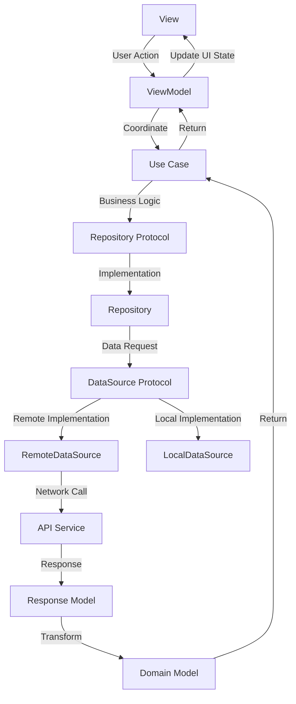

# Movy App Architecture Guide - Revised Edition 🍿

A comprehensive guide to understanding the **Modular Clean Architecture + MVVM** implementation in the Movy iOS app, incorporating feedback from iOS infrastructure engineering best practices.

## 📋 Table of Contents

1. [Overview](#overview)
2. [Modular Architecture Approach](#modular-architecture-approach)
3. [Feature-Based Structure](#feature-based-structure)
4. [Architecture Layers with Clear Boundaries](#architecture-layers-with-clear-boundaries)
5. [Data Flow](#data-flow)
6. [Code Examples](#code-examples)
7. [Design Patterns](#design-patterns)
8. [Dependency Management](#dependency-management)
9. [Testing Strategy](#testing-strategy)
10. [Project Decisions & Rationale](#project-decisions--rationale)

## Overview

Movy is a SwiftUI-based iOS movie search application that demonstrates **Modular Clean Architecture** principles combined with the **MVVM (Model-View-ViewModel)** pattern. This revised architecture addresses scalability concerns and promotes better separation of concerns through feature-based modularization.

### Key Benefits
- ✅ **Modular**: Feature-based modules for better scalability
- ✅ **Testable**: Each layer and module can be tested independently
- ✅ **Maintainable**: Clear boundaries and responsibilities
- ✅ **Scalable**: Easy to add new features without affecting existing ones
- ✅ **Flexible**: Easy to change implementations within modules
- ✅ **Memory Efficient**: Proper object lifecycle management

## Modular Architecture Approach

### Why Modular Architecture?

As applications grow, a flat architecture becomes difficult to maintain. Modular architecture provides:

- **Feature Isolation**: Each feature is self-contained
- **Reduced Build Times**: Only affected modules need rebuilding
- **Team Scalability**: Different teams can work on different modules
- **Cleaner Dependencies**: Explicit module boundaries
- **Easier Testing**: Module-specific test suites

### Module Types

1. **Feature Modules**: Self-contained features (Home, Movie, etc.)
2. **Infrastructure Modules**: Shared utilities and services
3. **Core Module**: Fundamental app components

## Feature-Based Structure

### Vertical Feature Organization

Each feature is organized vertically with all its layers:

```
Features/
├── Home/
│   ├── Presentation/
│   │   ├── HomeView.swift
│   │   └── HomeViewModel.swift
│   ├── Domain/
│   │   ├── Models/
│   │   │   └── HomeModel.swift
│   │   └── UseCases/
│   │       └── SearchMoviesUseCase.swift
│   └── Data/
│       ├── DataSources/
│       │   ├── HomeRemoteDataSource.swift
│       │   └── HomeLocalDataSource.swift
│       ├── Repositories/
│       │   └── HomeRepository.swift
│       └── Network/
│           └── HomeAPIService.swift
│
├── Movie/
│   ├── Presentation/
│   │   ├── MovieDetailView.swift
│   │   └── MovieDetailViewModel.swift
│   ├── Domain/
│   │   ├── Models/
│   │   │   └── MovieDetailModel.swift
│   │   └── UseCases/
│   │       └── GetMovieDetailUseCase.swift
│   └── Data/
│       ├── DataSources/
│       │   └── MovieRemoteDataSource.swift
│       ├── Repositories/
│       │   └── MovieRepository.swift
│       └── Network/
│           └── MovieAPIService.swift
│
└── Infrastructure/
    ├── Networking/          # Shared networking infrastructure
    ├── CommonUI/           # Shared UI components
    ├── Core/               # App-wide utilities
    └── Storage/            # Data persistence
```

### Import Strategy

With modular architecture, imports become more explicit and manageable:

```swift
// Feature-specific imports
import Home
import Movie

// Infrastructure imports
import Networking
import CommonUI
import Core
```

## Architecture Layers with Clear Boundaries

### 🎨 1. Presentation Layer

**Purpose**: Handles UI and user interactions

**Components**:
- **Views**: SwiftUI views that display data
- **ViewModels**: Observable objects that manage UI state and coordinate with business logic

**Clear Boundary**: ViewModels should NOT contain business logic, only UI state management and coordination.

### 🏢 2. Domain Layer (Business Logic)

**Purpose**: Contains pure business logic and rules (framework-independent)

**Components**:
- **Models**: Business entities (renamed from Entity for clarity)
- **Use Cases**: Specific business operations
- **Business Logic Objects**: Strategy patterns, Memento patterns, etc.
- **Protocols**: Abstractions for external dependencies

**Clear Boundary**: This layer should be completely independent of frameworks and external concerns.

### 💾 3. Data Layer

**Purpose**: Manages data sources and implements domain interfaces

**Components**:
- **Responses**: API response models (renamed from DTOs for clarity)
- **DataSources**: Abstraction layer between repositories and actual data sources
  - **RemoteDataSource**: Handles API calls
  - **LocalDataSource**: Handles local storage
- **Repositories**: Implementation of domain repository protocols
- **Network**: API service implementations

**Clear Boundary**: Repository should NOT access API services directly, but through DataSource abstractions.

### ⚙️ 4. Infrastructure Layer

**Purpose**: Provides shared utilities and cross-cutting concerns

**Components**:
- **Networking**: Base networking infrastructure
- **CommonUI**: Reusable UI components
- **Core**: App-wide utilities and extensions
- **Storage**: Data persistence mechanisms

## Data Flow



### Improved Data Flow Example:

1. **User searches for a movie** → `HomeView`
2. **View calls ViewModel** → `HomeViewModel.searchMovies()`
3. **ViewModel coordinates with Use Case** → `SearchMoviesUseCase.execute()`
4. **Use Case implements business logic and calls Repository** → `HomeRepository.searchMovies()`
5. **Repository calls DataSource** → `HomeRemoteDataSource.searchMovies()`
6. **DataSource calls API Service** → `HomeAPIService.searchMovies()`
7. **API returns Response models** → `[MovieSearchResponse]`
8. **DataSource transforms to Domain Models** → `[MovieModel]`
9. **Use Case applies business rules** → Filtered/processed `[MovieModel]`
10. **ViewModel updates UI state** → `@Published var movies`
11. **View automatically updates** → SwiftUI reactive updates

## Code Examples

### 🎯 Domain Model Example

```swift
// Features/Home/Domain/Models/MovieModel.swift
struct MovieModel {
    let id: String
    let title: String
    let year: String
    let type: MovieType
    let posterURL: URL?
    
    enum MovieType: String, CaseIterable {
        case movie = "movie"
        case series = "series"
        case episode = "episode"
    }
}
```

### 📡 Response Model Example

```swift
// Features/Home/Data/Responses/MovieSearchResponse.swift
struct MovieSearchResponse: Codable {
    let imdbID: String
    let title: String
    let year: String
    let type: String
    let poster: String
    
    enum CodingKeys: String, CodingKey {
        case imdbID = "imdbID"
        case title = "Title"
        case year = "Year"
        case type = "Type"
        case poster = "Poster"
    }
}
```

### 🔄 Use Case Example

```swift
// Features/Home/Domain/UseCases/SearchMoviesUseCase.swift
protocol SearchMoviesUseCaseProtocol {
    func execute(query: String) async -> Result<[MovieModel], Error>
}

class SearchMoviesUseCase: SearchMoviesUseCaseProtocol {
    private let repository: HomeRepositoryProtocol
    
    init(repository: HomeRepositoryProtocol) {
        self.repository = repository
    }
    
    func execute(query: String) async -> Result<[MovieModel], Error> {
        // Business logic: validate query
        guard !query.trimmingCharacters(in: .whitespacesAndNewlines).isEmpty else {
            return .failure(SearchError.emptyQuery)
        }
        
        // Business logic: minimum query length
        guard query.count >= 2 else {
            return .failure(SearchError.queryTooShort)
        }
        
        do {
            let movies = try await repository.searchMovies(query: query)
            // Business logic: filter out invalid entries
            let validMovies = movies.filter { !$0.title.isEmpty }
            return .success(validMovies)
        } catch {
            return .failure(error)
        }
    }
}

enum SearchError: Error {
    case emptyQuery
    case queryTooShort
}
```

### 🗄️ Repository with DataSource Example

```swift
// Features/Home/Domain/Protocols/HomeRepositoryProtocol.swift
protocol HomeRepositoryProtocol {
    func searchMovies(query: String) async throws -> [MovieModel]
}

// Features/Home/Data/Repositories/HomeRepository.swift
class HomeRepository: HomeRepositoryProtocol {
    private let remoteDataSource: HomeRemoteDataSourceProtocol
    private let localDataSource: HomeLocalDataSourceProtocol
    
    init(
        remoteDataSource: HomeRemoteDataSourceProtocol,
        localDataSource: HomeLocalDataSourceProtocol
    ) {
        self.remoteDataSource = remoteDataSource
        self.localDataSource = localDataSource
    }
    
    func searchMovies(query: String) async throws -> [MovieModel] {
        // Try local cache first
        if let cachedMovies = try? await localDataSource.getCachedMovies(for: query) {
            return cachedMovies
        }
        
        // Fetch from remote
        let movies = try await remoteDataSource.searchMovies(query: query)
        
        // Cache the results
        try? await localDataSource.cacheMovies(movies, for: query)
        
        return movies
    }
}
```

### 📊 DataSource Example

```swift
// Features/Home/Data/DataSources/HomeRemoteDataSourceProtocol.swift
protocol HomeRemoteDataSourceProtocol {
    func searchMovies(query: String) async throws -> [MovieModel]
}

// Features/Home/Data/DataSources/HomeRemoteDataSource.swift
class HomeRemoteDataSource: HomeRemoteDataSourceProtocol {
    private let apiService: HomeAPIServiceProtocol
    
    init(apiService: HomeAPIServiceProtocol) {
        self.apiService = apiService
    }
    
    func searchMovies(query: String) async throws -> [MovieModel] {
        let responses = try await apiService.searchMovies(query: query)
        return responses.compactMap { response in
            MovieModel(
                id: response.imdbID,
                title: response.title,
                year: response.year,
                type: MovieModel.MovieType(rawValue: response.type) ?? .movie,
                posterURL: URL(string: response.poster)
            )
        }
    }
}
```

### 🎭 ViewModel Example

```swift
// Features/Home/Presentation/HomeViewModel.swift
@MainActor
class HomeViewModel: ObservableObject {
    @Published var searchText = ""
    @Published var movies: [MovieModel] = []
    @Published var isLoading = false
    @Published var error: Error?
    
    private let searchUseCase: SearchMoviesUseCaseProtocol
    private var cancellables = Set<AnyCancellable>()
    
    init(searchUseCase: SearchMoviesUseCaseProtocol) {
        self.searchUseCase = searchUseCase
        setupSearchPublisher()
    }
    
    private func setupSearchPublisher() {
        $searchText
            .debounce(for: .milliseconds(500), scheduler: DispatchQueue.main)
            .removeDuplicates()
            .filter { !$0.isEmpty }
            .sink { [weak self] query in
                Task {
                    await self?.searchMovies(query: query)
                }
            }
            .store(in: &cancellables)
    }
    
    func searchMovies(query: String) async {
        isLoading = true
        error = nil
        
        let result = await searchUseCase.execute(query: query)
        
        switch result {
        case .success(let fetchedMovies):
            self.movies = fetchedMovies
        case .failure(let searchError):
            self.movies = []
            self.error = searchError
        }
        
        isLoading = false
    }
}
```

## Design Patterns

### 🏗️ 1. MVVM with Clear Boundaries

- **Model**: Domain models and business entities
- **View**: SwiftUI views (UI only)
- **ViewModel**: UI state management and coordination (NO business logic)

### 🧱 2. Repository Pattern with DataSource Abstraction

```swift
// Repository doesn't know about API details
class HomeRepository: HomeRepositoryProtocol {
    private let remoteDataSource: HomeRemoteDataSourceProtocol
    private let localDataSource: HomeLocalDataSourceProtocol
    
    // Repository orchestrates data sources
    func searchMovies(query: String) async throws -> [MovieModel] {
        // Implementation using data sources
    }
}
```

### 🎯 3. Use Case Pattern

Each use case represents a specific business operation:

```swift
// Single responsibility
class SearchMoviesUseCase: SearchMoviesUseCaseProtocol {
    func execute(query: String) async -> Result<[MovieModel], Error> {
        // Business logic implementation
    }
}

class GetMovieDetailUseCase: GetMovieDetailUseCaseProtocol {
    func execute(movieId: String) async -> Result<MovieDetailModel, Error> {
        // Different business logic
    }
}
```

### 💉 4. Protocol-Oriented Dependency Injection

```swift
// All dependencies are protocols for testability
class HomeViewModel: ObservableObject {
    private let searchUseCase: SearchMoviesUseCaseProtocol
    
    init(searchUseCase: SearchMoviesUseCaseProtocol) {
        self.searchUseCase = searchUseCase
    }
}
```

## Dependency Management

### Memory-Efficient Dependency Container

```swift
// Infrastructure/Core/DependencyContainer.swift
protocol DependencyContainerProtocol {
    func resolve<T>() -> T
    func register<T>(_ type: T.Type, factory: @escaping () -> T)
}

class DependencyContainer: DependencyContainerProtocol {
    private var factories: [String: () -> Any] = [:]
    private var singletons: [String: Any] = [:]
    
    // Register factory for creating instances when needed
    func register<T>(_ type: T.Type, factory: @escaping () -> T) {
        let key = String(describing: type)
        factories[key] = factory
    }
    
    // Register singleton (use sparingly)
    func registerSingleton<T>(_ type: T.Type, instance: T) {
        let key = String(describing: type)
        singletons[key] = instance
    }
    
    func resolve<T>() -> T {
        let key = String(describing: T.self)
        
        // Check singletons first
        if let singleton = singletons[key] as? T {
            return singleton
        }
        
        // Create new instance
        guard let factory = factories[key],
              let instance = factory() as? T else {
            fatalError("No registration found for \(T.self)")
        }
        
        return instance
    }
}
```

### Feature Module Assembly

```swift
// Features/Home/HomeModuleAssembly.swift
class HomeModuleAssembly {
    static func assemble(container: DependencyContainerProtocol) {
        // Register data layer
        container.register(HomeAPIServiceProtocol.self) {
            HomeAPIService()
        }
        
        container.register(HomeRemoteDataSourceProtocol.self) {
            HomeRemoteDataSource(apiService: container.resolve())
        }
        
        container.register(HomeLocalDataSourceProtocol.self) {
            HomeLocalDataSource()
        }
        
        container.register(HomeRepositoryProtocol.self) {
            HomeRepository(
                remoteDataSource: container.resolve(),
                localDataSource: container.resolve()
            )
        }
        
        // Register domain layer
        container.register(SearchMoviesUseCaseProtocol.self) {
            SearchMoviesUseCase(repository: container.resolve())
        }
        
        // Register presentation layer
        container.register(HomeViewModel.self) {
            HomeViewModel(searchUseCase: container.resolve())
        }
    }
}
```

## Testing Strategy

### Protocol-Based Testing

```swift
// Tests/HomeTests/HomeViewModelTests.swift
class HomeViewModelTests: XCTestCase {
    private var viewModel: HomeViewModel!
    private var mockSearchUseCase: MockSearchMoviesUseCase!
    
    override func setUp() {
        super.setUp()
        mockSearchUseCase = MockSearchMoviesUseCase()
        viewModel = HomeViewModel(searchUseCase: mockSearchUseCase)
    }
    
    func testSearchMoviesSuccess() async {
        // Given
        let expectedMovies = [MovieModel.mock()]
        mockSearchUseCase.result = .success(expectedMovies)
        
        // When
        await viewModel.searchMovies(query: "test")
        
        // Then
        XCTAssertEqual(viewModel.movies, expectedMovies)
        XCTAssertFalse(viewModel.isLoading)
        XCTAssertNil(viewModel.error)
    }
}

class MockSearchMoviesUseCase: SearchMoviesUseCaseProtocol {
    var result: Result<[MovieModel], Error> = .success([])
    
    func execute(query: String) async -> Result<[MovieModel], Error> {
        return result
    }
}
```

### Infrastructure Module Testing

```swift
// Tests/NetworkingTests/APIServiceTests.swift
class HomeAPIServiceTests: XCTestCase {
    private var apiService: HomeAPIService!
    private var mockURLSession: MockURLSession!
    
    override func setUp() {
        super.setUp()
        mockURLSession = MockURLSession()
        apiService = HomeAPIService(urlSession: mockURLSession)
    }
    
    func testSearchMoviesSuccess() async throws {
        // Given
        let mockResponse = MovieSearchResponse.mock()
        mockURLSession.data = try JSONEncoder().encode([mockResponse])
        
        // When
        let result = try await apiService.searchMovies(query: "test")
        
        // Then
        XCTAssertEqual(result.count, 1)
        XCTAssertEqual(result.first?.title, mockResponse.title)
    }
}
```

## Project Decisions & Rationale

### Why Tuist?

**Benefits**:
- **Project Generation**: Consistent project structure across team
- **Modularization**: Easy module creation and dependency management
- **Build Optimization**: Faster incremental builds with proper module boundaries
- **Team Scalability**: Standardized project configuration

**Costs**:
- **Learning Curve**: Team needs to understand Tuist concepts
- **Maintenance**: Additional tool to maintain and update
- **Complexity**: Extra abstraction layer over Xcode projects

**Decision**: Worth it for medium to large projects with multiple developers, as it enforces good architecture practices and improves build times.

### Why iOS 17+?

**Benefits**:
- **Latest SwiftUI Features**: Access to newest UI capabilities
- **Performance Improvements**: Better runtime performance
- **Modern Swift Features**: Latest language improvements
- **Reduced Legacy Code**: No need to support older iOS versions

**Costs**:
- **Limited Audience**: Excludes users on older iOS versions
- **Market Penetration**: Smaller potential user base initially

**Decision**: For a demo/portfolio project, using the latest iOS version showcases modern development skills and reduces complexity.

### Memory Management Strategy

**Approach**:
- **Minimal Singletons**: Only for truly global services (networking, logging)
- **Factory Pattern**: Create objects when needed
- **Weak References**: Prevent retain cycles in ViewModels
- **Lazy Loading**: Initialize expensive objects only when required

```swift
// Good: Factory-based creation
container.register(HomeViewModel.self) {
    HomeViewModel(searchUseCase: container.resolve())
}

// Avoid: Singleton for feature-specific objects
// lazy var homeViewModel: HomeViewModel = HomeViewModel() // ❌
```

---

**Happy Coding! 🎬✨**

This revised architecture provides a robust foundation for building scalable, maintainable iOS applications with clear module boundaries, proper separation of concerns, and efficient memory management.