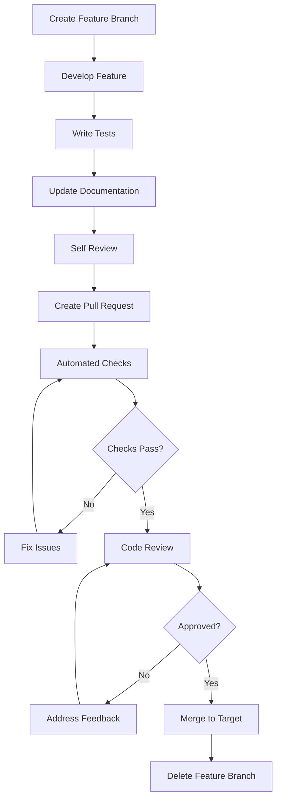

# Git Workflow Guide 🌿

A comprehensive guide to Git workflows, branching strategies, and collaboration best practices for iOS development teams.

## 📋 Table of Contents

1. [Workflow Overview](#workflow-overview)
2. [Branching Strategy](#branching-strategy)
3. [Commit Conventions](#commit-conventions)
4. [Pull Request Process](#pull-request-process)
5. [Code Review Guidelines](#code-review-guidelines)
6. [Release Management](#release-management)
7. [Git Best Practices](#git-best-practices)
8. [Common Scenarios](#common-scenarios)
9. [Troubleshooting](#troubleshooting)

## Workflow Overview

### 🎯 Goals

- **Maintain Code Quality**: Ensure all code is reviewed before merging
- **Enable Collaboration**: Multiple developers working efficiently
- **Track Changes**: Clear history of what changed and why
- **Support Releases**: Stable release process with hotfix capability
- **Minimize Conflicts**: Reduce merge conflicts and integration issues

### 🔄 Workflow Types

| Workflow | Team Size | Complexity | Best For |
|----------|-----------|------------|----------|
| **GitHub Flow** | Small (1-5) | Simple | Continuous deployment |
| **Git Flow** | Medium (5-15) | Complex | Scheduled releases |
| **GitLab Flow** | Large (15+) | Moderate | Feature-based development |

## Branching Strategy

### 🌳 Git Flow (Recommended)

```
master/main     ──●────●────●────●──  (Production releases)
                   │    │    │    │
release/v1.2.0  ───┼────●────●────┘   (Release preparation)
                   │    │    │
develop         ──●────●────●────●──  (Integration branch)
                  │ │   │ │  │ │  │
feature/login  ──●─┘   │ │  │ │  │    (Feature development)
feature/profile ───────●─┘  │ │  │    (Feature development)
hotfix/critical ─────────────●─┘  │    (Critical fixes)
bugfix/minor   ──────────────────●─┘   (Bug fixes)
```

### 📝 Branch Types

#### 🎯 Main Branches

```bash
# Main production branch
main/master
  ├── Contains production-ready code
  ├── Protected branch (no direct commits)
  ├── Tagged with version numbers
  └── Deployed to production

# Development integration branch
develop
  ├── Integration branch for features
  ├── Contains latest development changes
  ├── Base for feature branches
  └── Merged to main for releases
```

#### 🚀 Supporting Branches

```bash
# Feature branches
feature/[ticket-id]-[short-description]
  ├── Branch from: develop
  ├── Merge to: develop
  ├── Naming: feature/PROJ-123-user-authentication
  └── Lifespan: Until feature is complete

# Release branches
release/[version]
  ├── Branch from: develop
  ├── Merge to: main and develop
  ├── Naming: release/v1.2.0
  └── Purpose: Release preparation and bug fixes

# Hotfix branches
hotfix/[ticket-id]-[description]
  ├── Branch from: main
  ├── Merge to: main and develop
  ├── Naming: hotfix/PROJ-456-critical-crash
  └── Purpose: Critical production fixes

# Bugfix branches
bugfix/[ticket-id]-[description]
  ├── Branch from: develop
  ├── Merge to: develop
  ├── Naming: bugfix/PROJ-789-login-validation
  └── Purpose: Non-critical bug fixes
```

### 🔧 Branch Creation Commands

```bash
# Create and switch to feature branch
git checkout develop
git pull origin develop
git checkout -b feature/PROJ-123-user-authentication

# Create release branch
git checkout develop
git pull origin develop
git checkout -b release/v1.2.0

# Create hotfix branch
git checkout main
git pull origin main
git checkout -b hotfix/PROJ-456-critical-crash

# Create bugfix branch
git checkout develop
git pull origin develop
git checkout -b bugfix/PROJ-789-login-validation
```

## Commit Conventions

### 📝 Conventional Commits

```
<type>[optional scope]: <description>

[optional body]

[optional footer(s)]
```

#### 🏷️ Commit Types

| Type | Description | Example |
|------|-------------|----------|
| **feat** | New feature | `feat(auth): add biometric login` |
| **fix** | Bug fix | `fix(api): handle network timeout` |
| **docs** | Documentation | `docs(readme): update setup instructions` |
| **style** | Code style changes | `style(user): fix indentation` |
| **refactor** | Code refactoring | `refactor(network): extract base service` |
| **test** | Adding tests | `test(auth): add login validation tests` |
| **chore** | Maintenance tasks | `chore(deps): update dependencies` |
| **perf** | Performance improvements | `perf(images): optimize loading` |
| **ci** | CI/CD changes | `ci(github): add test workflow` |
| **build** | Build system changes | `build(xcode): update project settings` |

#### 📋 Commit Examples

```bash
# ✅ Good commits
feat(auth): implement OAuth2 authentication

fix(profile): resolve crash when loading user avatar
- Add nil check for avatar URL
- Handle network errors gracefully
- Add unit tests for edge cases

Closes #123

refactor(networking): extract common API client

BREAKING CHANGE: APIClient interface has changed
- Removed deprecated methods
- Updated error handling
- See migration guide in docs/

test(user): add comprehensive user model tests

docs(architecture): update MVVM documentation

chore(deps): bump Kingfisher to v7.4.1

# ❌ Bad commits
fixed stuff
update
working on feature
commit
changes
```

#### 🎯 Commit Best Practices

```bash
# ✅ Good practices

# 1. Use imperative mood
feat(auth): add login validation
# Not: feat(auth): added login validation

# 2. Keep subject line under 50 characters
fix(api): handle timeout errors

# 3. Separate subject and body with blank line
feat(profile): add user avatar upload

Implement image picker and upload functionality:
- Add camera and photo library access
- Compress images before upload
- Show upload progress indicator

# 4. Use body to explain what and why, not how
refactor(cache): improve memory management

Reduce memory footprint by implementing LRU cache eviction.
This prevents memory warnings on older devices with limited RAM.

# 5. Reference issues and PRs
fix(login): resolve keyboard dismissal issue

Closes #456
See also: #123, #789
```

### 🔧 Git Hooks for Commit Validation

```bash
#!/bin/sh
# .git/hooks/commit-msg

# Validate commit message format
commit_regex='^(feat|fix|docs|style|refactor|test|chore|perf|ci|build)(\(.+\))?: .{1,50}'

if ! grep -qE "$commit_regex" "$1"; then
    echo "Invalid commit message format!"
    echo "Format: <type>[optional scope]: <description>"
    echo "Example: feat(auth): add biometric login"
    exit 1
fi

# Check commit message length
if [ $(head -n1 "$1" | wc -c) -gt 72 ]; then
    echo "Commit message too long! Keep it under 72 characters."
    exit 1
fi
```

## Pull Request Process

### 🔄 PR Workflow



### 📝 PR Template

```markdown
## Description

Brief description of changes and motivation.

## Type of Change

- [ ] Bug fix (non-breaking change which fixes an issue)
- [ ] New feature (non-breaking change which adds functionality)
- [ ] Breaking change (fix or feature that would cause existing functionality to not work as expected)
- [ ] Documentation update
- [ ] Performance improvement
- [ ] Code refactoring

## Related Issues

Closes #[issue_number]
Related to #[issue_number]

## Changes Made

- [ ] Added/Modified feature X
- [ ] Fixed bug Y
- [ ] Updated documentation Z
- [ ] Added tests for new functionality

## Testing

### Test Coverage
- [ ] Unit tests added/updated
- [ ] Integration tests added/updated
- [ ] UI tests added/updated
- [ ] Manual testing completed

### Test Scenarios
1. **Scenario 1**: Description of test case
   - Expected: Expected behavior
   - Actual: Actual behavior

2. **Scenario 2**: Description of test case
   - Expected: Expected behavior
   - Actual: Actual behavior

## Screenshots/Videos

<!-- Add screenshots or videos demonstrating the changes -->

## Checklist

- [ ] Code follows project style guidelines
- [ ] Self-review completed
- [ ] Tests added/updated and passing
- [ ] Documentation updated
- [ ] No new warnings or errors
- [ ] Performance impact considered
- [ ] Accessibility guidelines followed (if applicable)
- [ ] Security implications reviewed

## Additional Notes

Any additional information, concerns, or considerations.
```

### 🎯 PR Best Practices

```bash
# ✅ Good PR practices

# 1. Keep PRs small and focused
# - Single feature or bug fix
# - Under 400 lines of changes
# - Easy to review and understand

# 2. Write descriptive titles
# Good: "feat(auth): implement biometric authentication"
# Bad: "Update login"

# 3. Provide context in description
# - What changed and why
# - How to test the changes
# - Any breaking changes

# 4. Update before creating PR
git checkout develop
git pull origin develop
git checkout feature/my-feature
git rebase develop  # or merge develop

# 5. Ensure CI passes
# - All tests pass
# - Code quality checks pass
# - No merge conflicts
```

## Code Review Guidelines

### 👀 Review Checklist

#### 🔍 Code Quality

- [ ] **Functionality**: Code works as intended
- [ ] **Readability**: Code is clear and well-documented
- [ ] **Performance**: No obvious performance issues
- [ ] **Security**: No security vulnerabilities
- [ ] **Error Handling**: Proper error handling implemented
- [ ] **Testing**: Adequate test coverage
- [ ] **Architecture**: Follows established patterns
- [ ] **Dependencies**: Minimal and appropriate dependencies

#### 📱 iOS Specific

- [ ] **Memory Management**: No retain cycles or leaks
- [ ] **Threading**: Proper use of main/background queues
- [ ] **UI/UX**: Follows iOS design guidelines
- [ ] **Accessibility**: VoiceOver and accessibility support
- [ ] **Performance**: Smooth scrolling and animations
- [ ] **Device Support**: Works on target devices/OS versions

### 💬 Review Comments

```swift
// ✅ Good review comments

// Suggestion with explanation
// Consider using a computed property here for better performance:
// var fullName: String {
//     return "\(firstName) \(lastName)"
// }

// Question for clarification
// Why are we using a custom implementation instead of the built-in method?

// Praise for good practices
// Great use of guard statements for early returns! 👍

// Security concern
// This could expose sensitive data in logs. Consider removing or masking.

// Performance suggestion
// This operation might be expensive on large datasets. 
// Consider adding pagination or lazy loading.

// ❌ Poor review comments
// "This is wrong"
// "Fix this"
// "Bad code"
// "I don't like this"
```

### 🎯 Review Response

```markdown
<!-- ✅ Good responses to review feedback -->

## Response to Review Comments

### @reviewer1 - Line 45: Memory leak concern
**Fixed**: Added weak reference to avoid retain cycle. 
Also added unit test to verify proper deallocation.

### @reviewer2 - Line 78: Performance optimization
**Implemented**: Added lazy loading as suggested. 
Performance improved by ~40% on large datasets.

### @reviewer3 - Line 120: Error handling
**Addressed**: Added comprehensive error handling with user-friendly messages.
Also updated documentation with error scenarios.

### @reviewer1 - Line 156: Architecture question
**Explanation**: Used custom implementation because built-in method 
doesn't support our specific validation requirements. 
Added comment in code for clarity.

## Additional Changes
- Updated unit tests to cover new scenarios
- Added documentation for new public methods
- Fixed minor formatting issues

Ready for re-review! 🚀
```

## Release Management

### 🚀 Release Process

```bash
# 1. Create release branch
git checkout develop
git pull origin develop
git checkout -b release/v1.2.0

# 2. Update version numbers
# - Update Info.plist
# - Update version constants
# - Update CHANGELOG.md

# 3. Final testing and bug fixes
# - Run full test suite
# - Perform manual testing
# - Fix any critical issues

# 4. Merge to main
git checkout main
git pull origin main
git merge --no-ff release/v1.2.0
git tag -a v1.2.0 -m "Release version 1.2.0"
git push origin main --tags

# 5. Merge back to develop
git checkout develop
git merge --no-ff release/v1.2.0
git push origin develop

# 6. Delete release branch
git branch -d release/v1.2.0
git push origin --delete release/v1.2.0
```

### 📋 Release Checklist

#### 🔄 Pre-Release

- [ ] **Code Complete**: All features implemented
- [ ] **Tests Passing**: All automated tests pass
- [ ] **Manual Testing**: QA testing completed
- [ ] **Performance**: Performance testing completed
- [ ] **Documentation**: Release notes prepared
- [ ] **Version Numbers**: Updated in all relevant files
- [ ] **Dependencies**: All dependencies up to date
- [ ] **Security**: Security review completed

#### 🚀 Release

- [ ] **Branch Created**: Release branch created from develop
- [ ] **Final Testing**: Last-minute testing completed
- [ ] **Merge to Main**: Release merged to main branch
- [ ] **Tag Created**: Version tag created and pushed
- [ ] **App Store**: Build uploaded to App Store Connect
- [ ] **Release Notes**: Release notes published
- [ ] **Merge Back**: Changes merged back to develop
- [ ] **Cleanup**: Release branch deleted

#### 📱 Post-Release

- [ ] **Monitoring**: App performance monitored
- [ ] **Feedback**: User feedback collected
- [ ] **Issues**: Any critical issues addressed
- [ ] **Metrics**: Release metrics analyzed
- [ ] **Retrospective**: Team retrospective conducted

### 🏷️ Semantic Versioning

```
MAJOR.MINOR.PATCH

MAJOR: Breaking changes (2.0.0)
MINOR: New features, backward compatible (1.1.0)
PATCH: Bug fixes, backward compatible (1.0.1)

Examples:
1.0.0 - Initial release
1.1.0 - Added user profiles
1.1.1 - Fixed login bug
1.2.0 - Added dark mode
2.0.0 - New architecture (breaking changes)
```

## Git Best Practices

### 🔧 Configuration

```bash
# Global Git configuration
git config --global user.name "Your Name"
git config --global user.email "your.email@company.com"
git config --global init.defaultBranch main
git config --global pull.rebase true
git config --global core.autocrlf input
git config --global core.editor "code --wait"

# Useful aliases
git config --global alias.co checkout
git config --global alias.br branch
git config --global alias.ci commit
git config --global alias.st status
git config --global alias.unstage 'reset HEAD --'
git config --global alias.last 'log -1 HEAD'
git config --global alias.visual '!gitk'
git config --global alias.lg "log --oneline --graph --decorate --all"
```

### 📝 Daily Workflow

```bash
# Start of day - sync with remote
git checkout develop
git pull origin develop

# Create feature branch
git checkout -b feature/PROJ-123-new-feature

# Work on feature
# ... make changes ...
git add .
git commit -m "feat(feature): implement core functionality"

# Regular commits
git add specific-file.swift
git commit -m "feat(feature): add validation logic"

# Push to remote regularly
git push origin feature/PROJ-123-new-feature

# Before creating PR - update with latest develop
git checkout develop
git pull origin develop
git checkout feature/PROJ-123-new-feature
git rebase develop

# Resolve any conflicts, then
git push origin feature/PROJ-123-new-feature --force-with-lease

# Create pull request
# ... PR process ...

# After merge - cleanup
git checkout develop
git pull origin develop
git branch -d feature/PROJ-123-new-feature
```

### 🧹 Repository Maintenance

```bash
# Clean up local branches
git branch --merged | grep -v "\*\|main\|develop" | xargs -n 1 git branch -d

# Clean up remote tracking branches
git remote prune origin

# View repository size
git count-objects -vH

# Clean up unreachable objects
git gc --aggressive --prune=now

# Check repository health
git fsck --full
```

## Common Scenarios

### 🔄 Scenario: Feature Development

```bash
# 1. Start new feature
git checkout develop
git pull origin develop
git checkout -b feature/PROJ-123-user-profile

# 2. Develop feature
# ... implement feature ...
git add .
git commit -m "feat(profile): add user profile view"

# 3. Add tests
# ... write tests ...
git add .
git commit -m "test(profile): add profile view tests"

# 4. Update documentation
# ... update docs ...
git add .
git commit -m "docs(profile): add profile feature documentation"

# 5. Sync with develop before PR
git checkout develop
git pull origin develop
git checkout feature/PROJ-123-user-profile
git rebase develop

# 6. Push and create PR
git push origin feature/PROJ-123-user-profile
# Create PR through GitHub/GitLab interface
```

### 🚨 Scenario: Hotfix

```bash
# 1. Create hotfix from main
git checkout main
git pull origin main
git checkout -b hotfix/PROJ-456-critical-crash

# 2. Fix the issue
# ... implement fix ...
git add .
git commit -m "fix(auth): resolve crash on invalid token"

# 3. Test the fix
# ... test thoroughly ...
git add .
git commit -m "test(auth): add test for token validation"

# 4. Merge to main
git checkout main
git merge --no-ff hotfix/PROJ-456-critical-crash
git tag -a v1.1.1 -m "Hotfix version 1.1.1"
git push origin main --tags

# 5. Merge to develop
git checkout develop
git merge --no-ff hotfix/PROJ-456-critical-crash
git push origin develop

# 6. Clean up
git branch -d hotfix/PROJ-456-critical-crash
git push origin --delete hotfix/PROJ-456-critical-crash
```

### 🔀 Scenario: Merge Conflicts

```bash
# When rebasing or merging
git rebase develop
# CONFLICT (content): Merge conflict in UserService.swift

# 1. Check conflicted files
git status

# 2. Open conflicted file and resolve
# Look for conflict markers:
# <<<<<<< HEAD
# Your changes
# =======
# Incoming changes
# >>>>>>> develop

# 3. Edit file to resolve conflicts
# Remove conflict markers and choose/combine changes

# 4. Mark as resolved
git add UserService.swift

# 5. Continue rebase
git rebase --continue

# 6. Push with force-with-lease
git push origin feature/my-branch --force-with-lease
```

## Troubleshooting

### 🔧 Common Issues

#### 📝 Undo Last Commit

```bash
# Undo last commit but keep changes
git reset --soft HEAD~1

# Undo last commit and discard changes
git reset --hard HEAD~1

# Undo last commit and create new commit
git revert HEAD
```

#### 🔄 Fix Commit Message

```bash
# Fix last commit message
git commit --amend -m "New commit message"

# Fix older commit message (interactive rebase)
git rebase -i HEAD~3
# Change 'pick' to 'reword' for commits to edit
```

#### 🧹 Remove File from Git History

```bash
# Remove file from last commit
git rm --cached file.txt
git commit --amend --no-edit

# Remove file from all history (dangerous!)
git filter-branch --force --index-filter \
  'git rm --cached --ignore-unmatch file.txt' \
  --prune-empty --tag-name-filter cat -- --all
```

#### 🔀 Recover Deleted Branch

```bash
# Find the commit hash
git reflog

# Recreate branch
git checkout -b recovered-branch <commit-hash>
```

### 🆘 Emergency Procedures

#### 🚨 Revert Production Release

```bash
# 1. Create revert commit
git checkout main
git revert <release-commit-hash>

# 2. Tag emergency release
git tag -a v1.1.2 -m "Emergency revert of v1.1.1"

# 3. Push immediately
git push origin main --tags

# 4. Merge to develop
git checkout develop
git merge main
git push origin develop
```

#### 🔥 Force Push Recovery

```bash
# If someone force-pushed and broke history
# 1. Find the good commit
git reflog

# 2. Reset to good state
git reset --hard <good-commit-hash>

# 3. Force push to restore
git push origin main --force-with-lease

# 4. Notify team immediately
```

---

## 📋 Quick Reference

### 🔧 Essential Commands

```bash
# Branch management
git branch -a                    # List all branches
git branch -d branch-name        # Delete local branch
git push origin --delete branch  # Delete remote branch

# Commit management
git log --oneline               # Compact log
git show <commit-hash>          # Show commit details
git diff HEAD~1                 # Compare with previous commit

# Stash management
git stash                       # Stash changes
git stash pop                   # Apply and remove stash
git stash list                  # List stashes

# Remote management
git remote -v                   # List remotes
git fetch --all                 # Fetch all remotes
git pull --rebase               # Pull with rebase
```

### 📱 iOS-Specific Git Patterns

```bash
# Xcode project files
# Always commit .xcodeproj changes
git add MyApp.xcodeproj/project.pbxproj

# Handle merge conflicts in project files
git checkout --theirs MyApp.xcodeproj/project.pbxproj
# Then re-add your changes manually in Xcode

# Ignore user-specific files
echo "*.xcuserstate" >> .gitignore
echo "xcuserdata/" >> .gitignore
echo "DerivedData/" >> .gitignore
```

---

**Remember**: Git is a powerful tool that enables effective collaboration. Follow these workflows consistently to maintain a clean, traceable, and collaborative codebase! 🚀